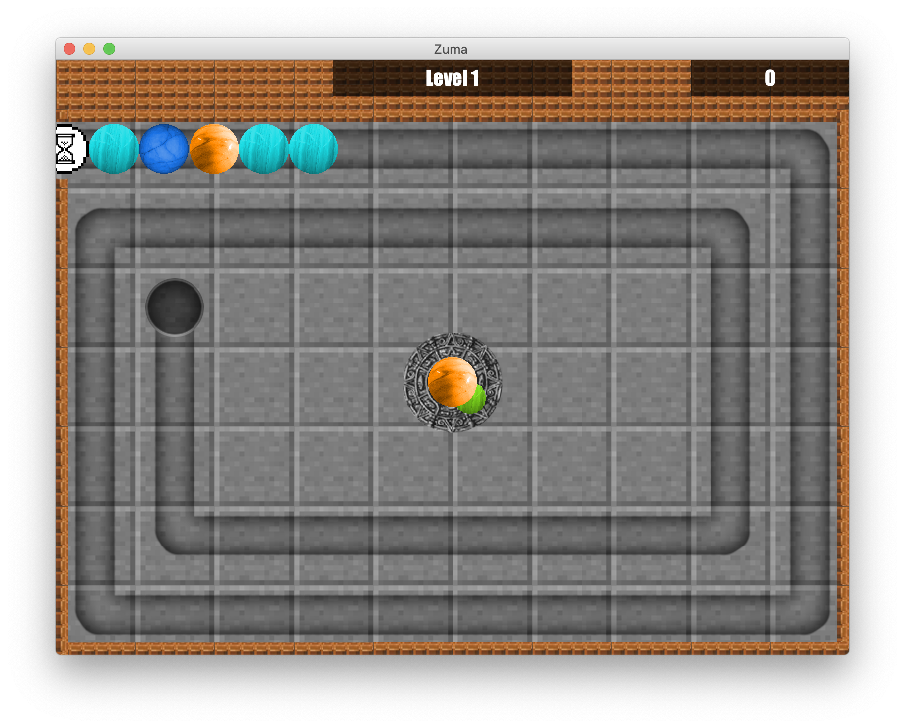

> One day I was bored in University, so I'd decided to recreate classic old game, but in new format.
> Please welcome....Face-Zuma. Here you can create your own texture pack and even sound packs.
> But if you're as lazy as me, you can just play game, while listening to lectures or having coffee break....
> So, enjoy ;) 




## Table of Contents
[General Info](#general-info)\
[Installation](#installation)\
[How to create your custom pack](#how-to-create-my-own-pack)\
[Current Status](#current-status)\
[Author](#author)

## General Info
This project recreates old arcade game called Zuma. At any time you have **2 balls**, which can be swapped by pressing **X** button.
The goal is to destroy raw of balls by shooting your balls in, since **every 3+ balls with same color destroys** and gives you point.
To shoot balls use **mouse button** or you can manually rotate player by pressing **A/D (Left/Right)** and shoot by pressing **Space**.

> Current version: 8.0\
> Current beta: 8.1.0

## Installation
Just download project and install required packages using pip:
```
pip install -r requirements.txt
```

## Launching
To start The App just run main.py file. One of the methods is to run this command via Terminal:
```
python3 main.py
```
## How to create my own pack?
#### How to create Texture pack?
If you want to create your own **pack of Textures**, you should create folder inside **images** and put your balls textures inside of it in **.png** format
#### How to create Sound pack to new Texture pack?
1. Create folder with **the same name** as Textures folder, but this time in **music** folder
2. Start putting your sounds in folder. Use **default** folder as an example
3. Notice, that acceptable format in audio effects is **wav** only, but background music can be mp3 as well
4. You dont have to create all sounds for pack. If something is missing, the game will automatically use default sound instead :)

## Current Status
Project development is slowed down, because I was bored of this App and Have not too much time right now to creating new updates.

## Author
### Savelev Matvey
> #### Github: [@SavelevMatthew](https://github.com/SavelevMatthew)
> ##### Email: savelevmatthew@gmail.com
